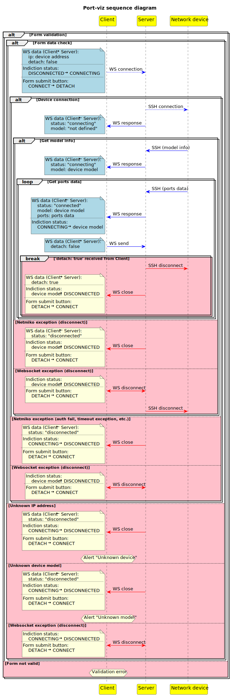

# Port-viz
**Port-viz** is a prototype of a port status visualization system for network devices using WebSockets.

### Stack:
   
   

### Tools and more:
  
   
   
     
 

|  |
|:--:| 
| *UI* |

### UML diagram:

